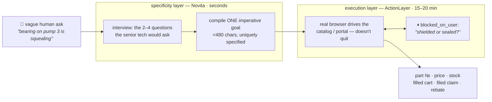
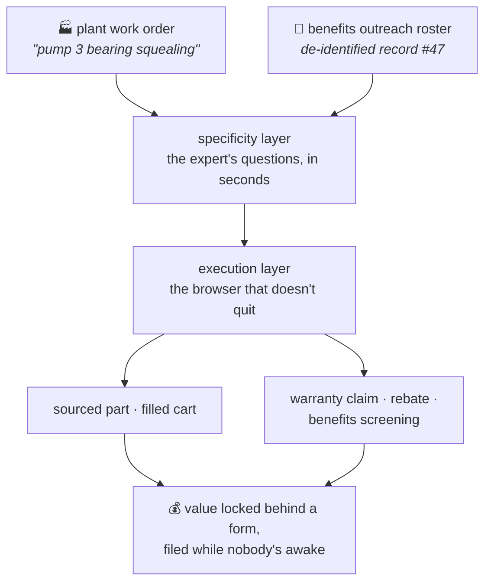

# thirdshift — the shift nobody staffs

> The last mile isn't authentication. It's specification.

Third shift files the specs; first shift finds the part on the bench.

_Last Mile Agent Hackathon, AWS Builder Loft SF, 2026-07-21. Novita (inference)
+ ActionLayer (browser execution). Everything below is measured tonight, live —
ticket IDs included so it can be checked._

## Why it matters

Capable browser agents don't fail because they can't act. They fail because
the human didn't say precisely enough what they wanted. We went in expecting
the wall to be OTPs, CAPTCHAs, login walls. We measured something else:

- Our benefits.gov ticket blocked **twice, both times on ambiguity** ("which
  specific benefit should be chosen?") — **never once on credentials**.
- Each block costs a full **15–20 minute** execution cycle.
- The same task, re-fired with a fully specified imperative goal, **completed
  with real federal screener output** (`tkt_LclPziYpSgddl0HA-tF3nQ`, see
  [WIN.md](WIN.md)).

Under-specification isn't a UX annoyance. It's the dominant failure mode, and
it's expensive. That reframes what the "last mile" product actually is.

The same task, fired twice tonight — the only difference is specification:

```mermaid
gantt
    title benefits.gov, measured live (elapsed minutes)
    dateFormat HH:mm
    axisFormat %H:%M
    section vague ask
    executes, blocks on ambiguity      :crit, v1, 00:00, 18m
    waits for a human answer           :crit, v2, after v1, 12m
    executes, blocks on ambiguity again:crit, v3, after v2, 15m
    fails — no answer                  :milestone, after v3
    section specified ask
    Novita interview + goal compile    :done, s1, 00:00, 1m
    executes straight through          :active, s2, after s1, 17m
    real eligibility output            :milestone, after s2
```



## What the tech can do

**ActionLayer** drives a real browser end-to-end on sites with no API —
including form-heavy government sites — but only when the goal uniquely
identifies what's wanted, and only at 15–20 min per success. **Novita** serves
fast, cheap open models (glm-5.2 et al.) in milliseconds-to-seconds.



The economics write the architecture: never spend a 20-minute browser cycle
discovering an ambiguity a 2-second model call could have caught. And
`blocked_on_user` isn't a failure mode — it's the junior tech texting the
retired one, at most one question per ticket.

Operating lessons we measured that aren't in anyone's docs ([WIN.md](WIN.md)):
- **Imperative goals succeed; meta-instructions fail.** "Complete this
  screener for…" works. "Report how far you got…" dies.
- **Concurrency is capped at ~1.** 8 simultaneous → all failed in ~3 min.
  6 staggered 20s apart → **all cancelled**. 1 alone → completed, 4/4.
  Fast failure (~3 min) = throttled; slow failure or slow success = it really
  drove a browser.
- Instructions truncate around ~500 chars — compile tight goals.
- **`blocked_on_user` detail is only on `GET /tasks/{id}`** — the documented
  `/v1/actions/tickets/{id}` and its MCP tool return nulls.
- Python-urllib's default User-Agent gets 403'd; curl doesn't. Set any UA.
- Novita models are reasoning models — `reasoning_content` eats the token
  budget before `content` exists. `max_tokens=400` returns `""`; use 3000+.

### The contradiction worth reporting

15–20 min/ticket makes ActionLayer unusable for a consumer concierge and
**ideal for overnight back-office batch work** — nobody is watching, and the
alternative is a human on hold for 45 minutes. That is the use case the latency
selects for. But the platform cancels or fails concurrent tickets. **The one
shape that fits the latency is the shape it can't do today.** Raise per-account
concurrency and the batch use case opens up.

## How we solved it — two verticals, one architecture

### 1. Plant maintenance manager ([PLANT.md](PLANT.md), [plant.py](plant.py))

Unplanned downtime is the most expensive thing in a plant, and the bottleneck
between "machine is down" and "part is ordered" is a human translating a symptom
into a catalog spec. That translation is tribal knowledge, and it is retiring.
Small facilities never had that person: the maintenance manager IS procurement.

Same two layers, zero new infrastructure, pointed at
industrial maintenance. "Bearing on pump 3 is squealing" → the specificity
layer asks what the retiring senior tech would ask → exact spec → ActionLayer
sources it on McMaster-Carr, which has **no self-serve ordering API for small
buyers** (their data API is approval-gated and order-less; punchout assumes an
ERP — see [RESEARCH.md](RESEARCH.md)). Read-only
by design: part number, price, stock — a human approves the filled cart.

**Measured:** `"bearing on pump 3 is squealing"` → `6203-2RS double rubber-sealed
ball bearing (17 mm bore, 40 mm OD, 12 mm width), qty 2, return part number, unit
price, and stock; do not add to cart or check out.` — 240 chars, generated in
seconds by Novita. That is the retiring tech's translation, done by a model.

- Live validation ticket `tkt_os-NZoZVT6Q_-w8vPo7ovA`: worked bot-hostile
  McMaster for **29 minutes, zero ambiguity questions**, then hit the login
  wall and **escalated instead of quitting** (`blocked_on_user`: "provide
  login credentials…"). The thesis refined, honestly: specification removes
  the unbounded ambiguity blocks; the residual wall on a B2B catalog is auth
  — a bounded block the platform natively hands to a human. Full read in
  [PLANT.md](PLANT.md).
- Second live ticket `tkt_8hDAny1kyyDvj6ewMii77w`: the `--rebate` goal,
  read-only on pge.com — no login expected; recorded when terminal.
- What we deliberately do NOT claim yet (checkout, an evaluated symptom→spec
  corpus) is listed there too.
- The concurrency cap doesn't hurt this vertical: a realistic nightly queue
  of work orders drains **sequentially** — 15–20 min × 20 work orders fits
  inside a single night shift with the cap exactly as it is today.

#### The features — one queue, four night-clerk moves

| mode | what the night clerk does | stops at | status |
|---|---|---|---|
| `plant.py "…"` | exact part on McMaster-Carr: part №, price, stock | read-only | ⏸ blocked on McMaster's login wall @29 min — escalated, didn't quit |
| `--cart` | filled cart + what checkout requires to order | before "Place Order" | built; fires when the slot frees |
| `--warranty` | manufacturer RMA claim, completed from the work order | before final submit | built, output below |
| `--rebate` | utility rebate owed for the efficiency swap: program, amount, deadline | read-only | built, output below |

Every mode stops short of the irreversible click by design — the human
approves; the night clerk did everything up to the signature. The recovery
modes are money already owed, unclaimed because a portal form is in the way
([PLANT.md](PLANT.md), "The layer above procurement").

Real output — `plant.py "pump 3 bearing failed, should still be in warranty" --warranty`:

```
  SPECIFIED WARRANTY GOAL
  Go to Grundfos's support site, find the warranty/RMA claim form, and
  complete it with: model CR 3 vertical multistage pump, serial
  GF-2024-118842, purchased 2025-03-14, invoice INV-8841, failure:
  motor-end bearing failure at ~14 months under normal duty; high-pitched
  squeal then seizure. Return the claim reference or the list of fields
  the final submission requires. Do not perform the final submission.
  405 chars · target: https://www.grundfos.com
```

Real output — `plant.py "we swapped pump 3 motor for a premium-efficiency one" --rebate`:

```
  SPECIFIED REBATE GOAL
  Search PG&E's California business rebate pages for programs covering
  replacement of a 5 HP pump motor with a NEMA Premium efficiency motor
  installed on 2026-07-10; return the applicable program name, rebate
  amount, required documentation, and filing deadline. Read-only—do not
  create accounts or submit applications.
  316 chars · target: https://www.pge.com
```

#### One night shift, drawn to scale

Concurrency is exactly 1 — measured, not assumed. The queue drains anyway:



```mermaid
gantt
    title 22:00 → 00:00 — six items, zero humans awake
    dateFormat HH:mm
    axisFormat %H:%M
    section parts
    WO-114 source bearing (McMaster)      :a1, 22:00, 20m
    WO-115 source drive belt (McMaster)   :a2, after a1, 20m
    WO-117 fill cart, qty 2 shaft seals   :a3, after a2, 20m
    section recovery
    Grundfos warranty claim (WO-102)      :b1, after a3, 20m
    PG&E motor rebate lookup (WO-102)     :b2, after b1, 20m
    Boiler cert renewal, state portal     :b3, after b2, 20m
```

First shift arrives to part numbers, a filled cart, a completed claim form,
and a rebate deadline — none of which existed at close of business.

### 2. De-identified batch SNAP screening for seniors ([SCOPE.md](SCOPE.md), [batch.py](batch.py))

The vertical where we have a **completed end-to-end run**. ~9M adults 65+ are eligible for SNAP and not enrolled; the #1 cited barrier is
the burden of applying. An org that already holds a roster (food bank, Area
Agency on Aging, PHA) hands over **de-identified** records — eligibility is
determined by age/household/income/rent/state, none of which identify anyone —
and we screen the whole roster overnight, in parallel.

- Single-record proof: **completed**, real screener output ("SSI: Likely
  eligible; Medicare with retirement: Likely eligible…") — [WIN.md](WIN.md).
- Batch fan-out is **built and blocked, not proven**: both fan-out attempts
  (8 simultaneous, then 6 staggered) were killed by the concurrency cap. The
  dashboard runs against real sequential tickets. We are not claiming batch
  throughput we did not achieve.
- The PII answer is structural: **the agent never sees a person.**
- The 15–20 min latency that kills consumer concierge is irrelevant overnight
  — the latency *selects* the use case.

## What it looks like

Real output, not a mockup — `python3 plant.py "bearing on pump 3 is squealing" --facts workorder.json --dry`:

```
════════════════════════════════════════════════════════════
  THE WORK ORDER
  "bearing on pump 3 is squealing"
  → a catalog search on this blocks or buys the wrong part

  SPECIFIED SOURCING GOAL
  Find a 6203-2RS double rubber-sealed ball bearing (17mm bore, 40mm OD,
  12mm width) on mcmaster.com and return the McMaster-Carr part number,
  unit price in USD, and whether it is in stock—read-only, do not add to
  cart or check out.
  230 chars

════════════════════════════════════════════════════════════
  "bearing is squealing" → wrong part, second truck roll
  exact spec → part number, price, stock — on the bench by first shift
════════════════════════════════════════════════════════════
```

The interview mode asks the technician the 2–4 questions the retiring senior
tech would have asked (equipment, markings/dimensions, quantity, urgency) —
each answerable in a few words — before compiling the goal. Without `--dry`,
that goal fires as a live browser ticket and the CLI tails it to terminal state.

## Prove it

```bash
python3 verify.py
```

Re-fetches every ticket cited in this repo from the live ActionLayer API and
checks the recorded state still matches. **Nothing here is asserted from
memory** — successes, failures, and cancellations alike. Exit 0 = every claim
holds. The ledger is [evidence/tickets.json](evidence/tickets.json).

```
  all 12 claims verified against the live API.
```

### In flight at submission time

Two tickets were still `pending` when we submitted (fired 19:05, past the usual
15–20 min — the API is under hackathon load). They are deliberately **not** in the
verified ledger, because we only claim what we can prove:

| Ticket | What it would add |
|---|---|
| `tkt_os-NZoZVT6Q_-w8vPo7ovA` | McMaster sourcing execution for the plant vertical |
| `tkt_a9_WAN5aAe0pPdlD9KkY8g` | a second completed SNAP record |

Check them yourself: `./al.sh get tkt_os-NZoZVT6Q_-w8vPo7ovA`

**What the plant vertical proves without them:** the symptom→spec translation runs
in seconds and is fully reproducible offline — `python3 plant.py "bearing on pump 3
is squealing" --facts workorder.json --dry`. The execution half is proven by the
SNAP vertical, which completed on a real federal site. Same `al_fire`, same poller,
same code path — `plant.py` imports both directly from `snap.py`.

## Run it

```bash
python3 plant.py "bearing on pump 3 is squealing"      # source the part (read-only)
python3 plant.py "..." --cart                          # fill cart, stop before the order
python3 plant.py "pump 3 bearing failed in warranty" --warranty   # complete the RMA form
python3 plant.py "swapped pump 3 motor for premium-eff" --rebate  # find the rebate owed
python3 plant.py "..." --dry                           # specificity layer only, ~4s, no ticket
python3 snap.py  "my mom needs help with groceries"    # benefits vertical, interview mode
python3 verify.py                                      # re-verify every claim, live
```

Zero dependencies — Python stdlib only. Needs `.env` with `NOVITA_API_KEY`,
`ACTIONLAYER_API_KEY`.

## The one-sentence pitch

> Agents don't need a better browser. They need the two questions an expert
> would have asked first — so the slow, expensive executor only ever runs a
> goal that can't block.

And the two verticals are one product: a senior's benefits screening and a
plant's warranty claim are the same thing — **value locked behind a form
nobody has time to fill**. The layer where a slow, sequential,
never-quits browser agent shines is recovery paperwork: warranty/RMA claims,
utility rebates, compliance renewals, benefits ([PLANT.md](PLANT.md), "The
layer above procurement"). thirdshift is the night clerk that files them.


