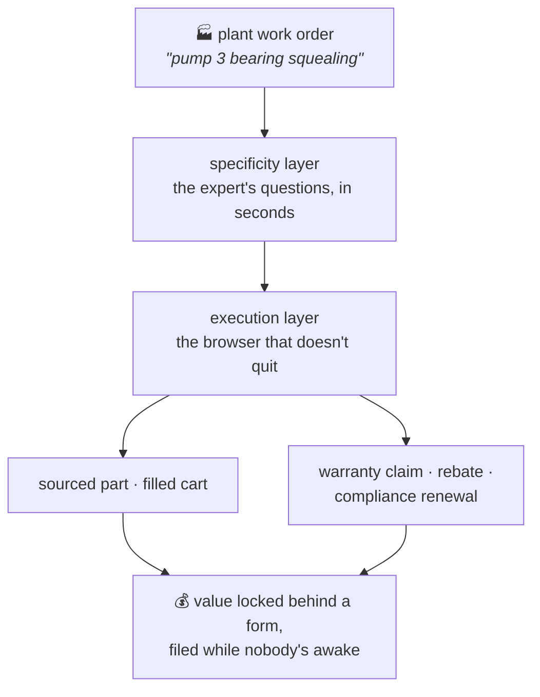

```mermaid
gantt
    title the same task, fired twice — the only difference is specification
    dateFormat HH:mm
    axisFormat %H:%M
    section vague ask
    executes, blocks on ambiguity      :crit, v1, 00:00, 18m
    waits for a human answer           :crit, v2, after v1, 12m
    executes, blocks on ambiguity again:crit, v3, after v2, 15m
    fails — no answer                  :milestone, after v3
    section specified ask
    Novita interview + goal compile    :done, s1, 00:00, 1m
    executes straight through          :active, s2, after s1, 17m
    real output                        :milestone, after s2
```

# thirdshift — the shift nobody staffs

> Your CMMS knows that pump 3 is down. Nothing in your stack gets the part on
> the bench. thirdshift is the night clerk that does.

_Last Mile Agent Hackathon, AWS Builder Loft SF, 2026-07-21. Novita
(inference) + ActionLayer (browser execution). Numbers below are either
measured live tonight with the ticket ID attached, or cited in
[RESEARCH.md](RESEARCH.md). `python3 verify.py` re-checks every ticket
against the API._

## The problem

Unplanned downtime is the most expensive event in a plant. The world's 500
largest manufacturers lose $1.4 trillion a year to it, 11% of revenue, and an
idle automotive line runs $2.3M an hour (Siemens/Senseye, "True Cost of
Downtime 2024").

Between "machine is down" and "part is ordered" sits one person, translating
a symptom into a catalog specification:

> "Bearing on pump 3 is squealing" → 6203-2RS, double rubber-sealed, 17 mm
> bore, 40 mm OD, 12 mm width, qty 2.

That translation is tribal knowledge, and it is retiring. US manufacturing
needs 3.8M new workers by 2033 and expects 1.9M positions to go unfilled,
with Baby Boomer retirement a named driver (Deloitte + The Manufacturing
Institute, 2024). Small facilities never had that person to begin with. In a
property portfolio, a single-line food plant, or a machine shop, the
maintenance manager *is* procurement.

Nothing in the stack closes the gap:

- **CMMS stops at paperwork.** MaintainX's own feature pages cover low-stock
  alerts, PO generation, and vendor records. A human still identifies the
  part and places the supplier order.
- **The catalog has no door for small buyers.** McMaster-Carr's data API is
  approval-gated and returns product data only, no ordering. Punchout and
  cXML assume you already run e-procurement. At ten employees, you get the
  browser.
- **MRO is unmanaged tail spend.** A $700–770B market in which roughly 80% of
  purchase transactions account for 20% of spend, and nobody is watching
  them.

Getting the translation wrong costs twice. In adjacent industries about one
in five parts ordered online comes back, and an avoidable truck roll runs
$150–$500. The number that matters is work-order-open → part-on-bench, and
every hour of it on a down line is the most expensive hour in the plant.

## What thirdshift does

Type what the technician said. thirdshift asks the two to four questions the
retiring senior tech would have asked, compiles one exact imperative goal,
and then puts a real browser on the supplier and utility portals overnight —
the sites that will never give a small facility an API.

One queue, four night-clerk moves:

| mode | what the night clerk does | stops at |
|---|---|---|
| `plant.py "…"` | exact part on McMaster-Carr: part №, price, stock | read-only |
| `--cart` | filled cart + what checkout requires to order | before "Place Order" |
| `--warranty` | manufacturer RMA claim, completed from the work order | before final submit |
| `--rebate` | utility rebate owed for the efficiency swap: program, amount, deadline | read-only |

Every mode stops before the irreversible click. The human signs; the night
clerk did everything up to the signature.

The recovery modes go after money the facility already owns and never
collects, because a portal form stands in front of it. Nobody files an RMA
for a $40 bearing, so a year of work orders quietly donates real money to
vendors. Utility rebates expire on deadlines nobody tracks. Compliance
renewals carry fines that dwarf the filing effort. thirdshift is already
holding the part, the failure date, and the symptom, so the claim writes
itself.

### One night shift, drawn to scale

```mermaid
gantt
    title 22:00 → 00:00 — six items, zero humans awake
    dateFormat HH:mm
    axisFormat %H:%M
    section parts
    WO-114 source bearing (McMaster)      :a1, 22:00, 20m
    WO-115 source drive belt (McMaster)   :a2, after a1, 20m
    WO-117 fill cart, qty 2 shaft seals   :a3, after a2, 20m
    section recovery
    Grundfos warranty claim (WO-102)      :b1, after a3, 20m
    PG&E motor rebate lookup (WO-102)     :b2, after b1, 20m
    Boiler cert renewal, state portal     :b3, after b2, 20m
```



First shift arrives to part numbers, a filled cart, a completed claim form,
and a rebate deadline, none of which existed at close of business.

## The money — one plant, one year

Reference plant: single line, ~$20M revenue, ~20 sourced-part work orders a
month, one maintenance manager doubling as procurement. Inputs and sources
are in [RESEARCH.md](RESEARCH.md) §7–10, and where a source gave a range the
model takes the low end.

**Money saved:**

| line | mechanism | year one |
|---|---|---|
| down-line hours removed | the part gets sourced overnight instead of whenever the manager gets to it; counting only 4 events a year where the part path is critical, 1 hour each, at the $10K/hr discrete-manufacturing floor | **$40,000** |
| wrong-part reorders avoided | about 1 in 5 parts ordered online is returned; an exact spec halves it — 24 avoided reorders a year, rush freight plus repeat labor | **$4,000** |
| manager hours returned | 240 sourcing sessions a year × 30 min × $58/hr (BLS median, industrial production manager) | **$7,000** |

**Money made — cash in, not cost avoided:**

| line | mechanism | year one |
|---|---|---|
| warranty claims filed | manual tracking leaves most eligible claims unfiled; systematic filing recovers the bulk of them, against a modest $12K/yr of warranty-eligible failures | **$8,000** |
| utility rebates claimed | motor rebates run $40–$7,000 per qualifying swap; counting 3 small-motor swaps | **$1,500** |
| compliance fines avoided | one lapsed cert or missed renewal | not counted |

**~$60K in year one: roughly $50K saved, $10K in new cash** — against a
marginal run cost of pennies of open-model inference per goal plus one
browser ticket per work order.

The sensitivity only runs one way. That downtime line is 4 hours at the floor
of the published range; the same 4 hours at the top of the discrete band
($50K/hr) is $200K, and every additional hour the overnight queue removes is
another $10–50K on top. The recovery lines have the opposite shape: small,
certain, cumulative. They are what pays for the tool in cash even if you
credit it with zero downtime hours.

## The evidence — measured live tonight

**Browser agents don't fail because they can't act. They fail because the
human didn't say precisely enough what they wanted.** We went in expecting
OTPs, CAPTCHAs, and login walls, and measured something else. On a live
federal form portal, the calibration ticket blocked twice, both times on
ambiguity, never once on credentials. Each block burns a full 15–20 minute
execution cycle. Re-fired with a fully specified imperative goal, the same
task completed with real output (`tkt_LclPziYpSgddl0HA-tF3nQ`,
[WIN.md](WIN.md)).



**The plant run** (`tkt_os-NZoZVT6Q_-w8vPo7ovA`): the specified sourcing goal
worked bot-hostile McMaster-Carr for **29 minutes without asking a single
clarifying question**, then hit the login wall and escalated rather than
quitting (`blocked_on_user`: "provide login credentials…"). That refines the
thesis instead of confirming it. Specification eliminates the unbounded
ambiguity blocks; what's left on a B2B catalog is auth, which is a bounded
block the platform hands to a human and a real facility account resolves.
Full read in [PLANT.md](PLANT.md).

**The concurrency envelope** ([WIN.md](WIN.md)): 8 simultaneous tickets all
failed in ~3 min, 6 staggered 20 s apart were all cancelled, 1 alone
completed repeatedly. That cap doesn't hurt this vertical. A realistic
nightly queue of ~20 work orders drains sequentially inside one night shift
with the cap exactly as it is. The 15–20 min latency that kills a consumer
concierge is irrelevant at 2 AM; **the latency selects the use case**.

Operating lessons that aren't in anyone's docs:

- **Imperative goals succeed, meta-instructions fail.** "Complete this form
  for…" works. "Report how far you got…" dies.
- Instructions truncate around 500 chars, so compile tight goals.
- **`blocked_on_user` detail lives only on `GET /tasks/{id}`.** The
  documented `/v1/actions/tickets/{id}` and its MCP tool return nulls.
- Python-urllib's default User-Agent gets 403'd where curl doesn't. Set any
  UA.
- Novita models are reasoning models: `reasoning_content` eats the token
  budget before `content` exists. `max_tokens=400` returns `""`. Use 3000+.

## How it works

Two layers. The fast one asks; the slow one acts.


The economics write the architecture: never spend a 20-minute browser cycle
discovering an ambiguity a 2-second model call could have caught. And
`blocked_on_user` isn't a failure mode, it's the junior tech texting the
retired one — at most one question per ticket.

Real output — `python3 plant.py "bearing on pump 3 is squealing" --facts workorder.json --dry`:

```
════════════════════════════════════════════════════════════
  THE WORK ORDER
  "bearing on pump 3 is squealing"
  → a catalog search on this blocks or buys the wrong part

  SPECIFIED SOURCING GOAL
  Find a 6203-2RS double rubber-sealed ball bearing (17mm bore, 40mm OD,
  12mm width) on mcmaster.com and return the McMaster-Carr part number,
  unit price in USD, and whether it is in stock—read-only, do not add to
  cart or check out.
  230 chars

════════════════════════════════════════════════════════════
  "bearing is squealing" → wrong part, second truck roll
  exact spec → part number, price, stock — on the bench by first shift
════════════════════════════════════════════════════════════
```

Real output — `plant.py "pump 3 bearing failed, should still be in warranty" --warranty`:

```
  SPECIFIED WARRANTY GOAL
  Go to Grundfos's support site, find the warranty/RMA claim form, and
  complete it with: model CR 3 vertical multistage pump, serial
  GF-2024-118842, purchased 2025-03-14, invoice INV-8841, failure:
  motor-end bearing failure at ~14 months under normal duty; high-pitched
  squeal then seizure. Return the claim reference or the list of fields
  the final submission requires. Do not perform the final submission.
  405 chars · target: https://www.grundfos.com
```

Real output — `plant.py "we swapped pump 3 motor for a premium-efficiency one" --rebate`:

```
  SPECIFIED REBATE GOAL
  Search PG&E's California business rebate pages for programs covering
  replacement of a 5 HP pump motor with a NEMA Premium efficiency motor
  installed on 2026-07-10; return the applicable program name, rebate
  amount, required documentation, and filing deadline. Read-only—do not
  create accounts or submit applications.
  316 chars · target: https://www.pge.com
```

That 230-character sourcing goal is the retiring tech's translation, done by
a model in seconds. Drop `--dry` and the goal fires as a live browser ticket,
with the CLI tailing it to terminal state.

## Prove it

```bash
python3 verify.py
```

Re-fetches every ticket cited in this repo from the live ActionLayer API and
checks the recorded state still matches. Successes, failures, and
cancellations alike — nothing here is asserted from memory. Exit 0 means
every claim holds. The ledger is
[evidence/tickets.json](evidence/tickets.json).

```
  all 12 claims verified against the live API.
```

Tickets still `pending` at submission time stay out of the ledger. Check one
yourself: `./al.sh get tkt_os-NZoZVT6Q_-w8vPo7ovA`

## Run it

```bash
python3 plant.py "bearing on pump 3 is squealing"      # source the part (read-only)
python3 plant.py "..." --cart                          # fill cart, stop before the order
python3 plant.py "pump 3 bearing failed in warranty" --warranty   # complete the RMA form
python3 plant.py "swapped pump 3 motor for premium-eff" --rebate  # find the rebate owed
python3 plant.py "..." --dry                           # specificity layer only, ~4s, no ticket
python3 verify.py                                      # re-verify every claim, live
```

Zero dependencies, Python stdlib only. Needs `.env` with `NOVITA_API_KEY`
and `ACTIONLAYER_API_KEY`.

## Scope

- **Sourcing is read-only.** The ticket returns part number, price, and
  stock. Purchasing is a human click on a filled cart, capped by
  `max_budget_usd` once checkout is wired. No checkout evidence yet.
- **Symptom→spec is prompted, not yet evaluated.** A pilot needs a facility's
  historical work orders with what was actually ordered as ground truth.
- **The dollar model is a model.** Every input is at the low end of a
  published range, but no line has been measured at a real facility. The
  pilot replaces it with a stopwatch.
- Fortune-500 downtime figures get extrapolated down to small facilities.

## The one-sentence pitch

> Agents don't need a better browser. They need the two questions an expert
> would have asked first, so the slow, expensive executor only ever runs a
> goal that can't block.

The layer where a slow, sequential, never-quits browser agent shines is the
paperwork nobody staffs: parts sourcing, warranty claims, rebates,
compliance renewals. **Value locked behind a form nobody has time to fill.**
thirdshift is the night clerk that files them.


