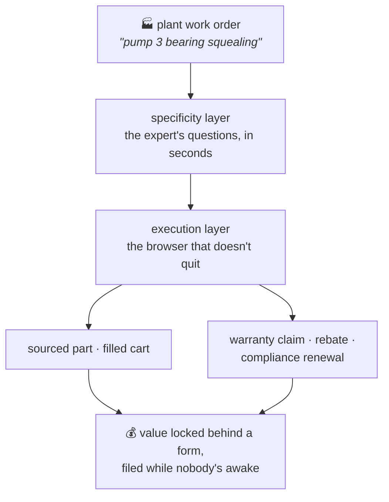

# thirdshift — the shift nobody staffs

> Your CMMS knows that pump 3 is down. Nothing in your stack gets the part on
> the bench. thirdshift is the night clerk that does.

_Last Mile Agent Hackathon, AWS Builder Loft SF, 2026-07-21. Novita
(inference) + ActionLayer (browser execution). Every number in this file is
measured live tonight, or is cited and graded in [RESEARCH.md](RESEARCH.md).
Ticket IDs are included. Run `python3 verify.py` to check each claim against
the live API._

## The problem

Unplanned downtime is the most expensive event in a plant. The world's 500
largest manufacturers lose approximately **$1.4 trillion each year** to it —
11% of revenue. An idle automotive line loses up to **$2.3M per hour**
(Siemens/Senseye, "True Cost of Downtime 2024" — sources and honesty grades
in [RESEARCH.md](RESEARCH.md)).

Between "machine is down" and "part is ordered" sits one person. That person
hears a symptom and translates it into a catalog specification:

> "Bearing on pump 3 is squealing" → 6203-2RS, double rubber-sealed, 17 mm
> bore, 40 mm OD, 12 mm width, qty 2.

That translation is tribal knowledge, and it is retiring. US manufacturing
needs up to **3.8M new workers by 2033**; approximately **1.9M positions
will stay unfilled**, with Baby Boomer retirement a named driver (Deloitte +
The Manufacturing Institute, 2024). Small facilities never had that person
at all: in a property portfolio, a single-line food plant, or a machine
shop, **the maintenance manager is procurement**.

The software stack does not close this gap:

- **CMMS platforms stop at paperwork.** MaintainX's own feature pages
  describe low-stock alerts, PO generation, and vendor records. A human
  still identifies the part and places the supplier order. (Verified
  directly for MaintainX; leading platforms describe the same scope.)
- **The catalog has no door for small buyers.** McMaster-Carr's data API is
  approval-gated and retrieves product data only — no ordering. Its
  punchout/cXML path assumes you already run an e-procurement system. For a
  10-person facility, **the browser is the only way to order**.
- **MRO is unmanaged tail spend.** The global MRO market is ~$700–770B
  (2025); roughly 80% of purchase transactions represent ~20% of spend and
  get no procurement attention.

And the wrong translation is expensive twice: in adjacent industries,
approximately **1 in 5 parts ordered online is returned**, and each
avoidable truck roll costs $150–$500. The metric that matters is
**work-order-open → part-on-bench**. Every hour of that interval on a down
line is the most expensive hour in the plant.

## What thirdshift does

Type what the technician said. thirdshift asks the 2–4 questions the
retiring senior tech would have asked. It compiles one exact, imperative
goal. Then a real browser works the supplier and utility portals overnight —
the sites that will never give a small facility an API.

One queue, four night-clerk moves:

| mode | what the night clerk does | stops at |
|---|---|---|
| `plant.py "…"` | exact part on McMaster-Carr: part №, price, stock | read-only |
| `--cart` | filled cart + what checkout requires to order | before "Place Order" |
| `--warranty` | manufacturer RMA claim, completed from the work order | before final submit |
| `--rebate` | utility rebate owed for the efficiency swap: program, amount, deadline | read-only |

Each mode stops before the irreversible click. The human gives the
approval; the night clerk did everything up to the signature.

The recovery modes are money the facility already owns, unclaimed because a
portal form is in the way. Nobody files an RMA for a $40 bearing; a year of
work orders quietly donates real money to vendors. Utility rebates expire
on deadlines nobody tracks. Compliance renewals carry fines that dwarf the
filing effort. thirdshift already holds the part, the failure date, and the
symptom — the claim writes itself.

### One night shift, drawn to scale

```mermaid
gantt
    title 22:00 → 00:00 — six items, zero humans awake
    dateFormat HH:mm
    axisFormat %H:%M
    section parts
    WO-114 source bearing (McMaster)      :a1, 22:00, 20m
    WO-115 source drive belt (McMaster)   :a2, after a1, 20m
    WO-117 fill cart, qty 2 shaft seals   :a3, after a2, 20m
    section recovery
    Grundfos warranty claim (WO-102)      :b1, after a3, 20m
    PG&E motor rebate lookup (WO-102)     :b2, after b1, 20m
    Boiler cert renewal, state portal     :b3, after b2, 20m
```



First shift arrives to part numbers, a filled cart, a completed claim form,
and a rebate deadline — none of which existed at close of business.

## The money — one plant, one year

The reference plant is the buyer we named: a single-line facility,
~$20M revenue, ~20 sourced-part work orders per month, one maintenance
manager who is also procurement. Every input below sits at the **bottom** of
its published range, and every range is graded in
[RESEARCH.md](RESEARCH.md) §7–10. This is a model, not a measurement — the
pilot metric that replaces it is work-order-open → part-on-bench.

**Money saved:**

| line | mechanism | conservative year-one value |
|---|---|---|
| down-line hours removed | the part is sourced overnight, not when the manager gets to it; count only 4 downtime events/yr where the part path is critical, 1 hour saved each, at the $10K/hr discrete-manufacturing floor | **$40,000** |
| wrong-part reorders avoided | ~1 in 5 parts ordered online is returned (adjacent industries); an exact spec halves it: 24 avoided reorders/yr × rush-shipping premium and repeat labor | **$4,000** |
| manager hours returned | 240 sourcing sessions/yr × 30 min each × ~$58/hr (BLS, industrial production manager median) | **$7,000** |

**Money made — cash in, not cost avoided:**

| line | mechanism | conservative year-one value |
|---|---|---|
| warranty claims filed | under manual tracking most eligible claims are never filed (vendor-reported recovery ~30% → 85–95% when systematic); on a modest $12K/yr of warranty-eligible failures | **$8,000** |
| utility rebates claimed | motor rebates run $40–$7,000 per qualifying swap; count 3 small-motor swaps | **$1,500** |
| compliance fines avoided | one lapsed cert or missed renewal — real but unpriced | not counted |

**Total: ~$60K in year one — roughly $50K saved, $10K new cash in** — against
a marginal run cost of pennies of open-model inference per goal and one
browser ticket per work order.

The sensitivity runs one direction. The downtime line is 4 hours at the
floor of the range; the same 4 hours at the top of the discrete band
($50K/hr) is $200K, and every *additional* hour the overnight queue removes
is another $10–50K. The recovery lines are the opposite shape: small,
certain, and cumulative — they are the lines that pay for the tool in cash
even if you never credit it with a single downtime hour.

## The evidence — measured live tonight

**The core finding: browser agents do not fail because they cannot act.
They fail because the human did not say precisely enough what they wanted.**
We expected the wall to be OTPs, CAPTCHAs, and login pages. We measured
something else. On a live federal form portal, our calibration ticket
blocked twice, both times on ambiguity — never once on credentials. Each
block costs a full 15–20 minute execution cycle. The same task, re-fired
with a fully specified imperative goal, completed with real output
(`tkt_LclPziYpSgddl0HA-tF3nQ`, [WIN.md](WIN.md)).

```mermaid
gantt
    title the same task, fired twice — the only difference is specification
    dateFormat HH:mm
    axisFormat %H:%M
    section vague ask
    executes, blocks on ambiguity      :crit, v1, 00:00, 18m
    waits for a human answer           :crit, v2, after v1, 12m
    executes, blocks on ambiguity again:crit, v3, after v2, 15m
    fails — no answer                  :milestone, after v3
    section specified ask
    Novita interview + goal compile    :done, s1, 00:00, 1m
    executes straight through          :active, s2, after s1, 17m
    real output                        :milestone, after s2
```



**The plant validation** (`tkt_os-NZoZVT6Q_-w8vPo7ovA`): the specified
sourcing goal worked bot-hostile McMaster-Carr for **29 minutes with zero
ambiguity questions**, then hit the login wall and **escalated instead of
quitting** (`blocked_on_user`: "provide login credentials…"). Read
honestly, this refines the thesis: specification removes the unbounded
ambiguity blocks. The residual wall on a B2B catalog is auth — a bounded
block the platform natively hands to a human, and one a real facility
account resolves. Full read in [PLANT.md](PLANT.md).

**The concurrency envelope** ([WIN.md](WIN.md)): 8 simultaneous tickets →
all failed in ~3 min. 6 staggered 20 s apart → all cancelled. 1 alone →
completed, repeatedly. The cap does not hurt this vertical: a realistic
nightly queue of ~20 work orders drains **sequentially** inside a single
night shift, with the cap exactly as it is today. The 15–20 min latency
that kills a consumer concierge is irrelevant at 2 AM — **the latency
selects the use case**.

Operating lessons we measured that are not in anyone's docs:

- **Imperative goals succeed; meta-instructions fail.** "Complete this form
  for…" works. "Report how far you got…" dies.
- Instructions truncate around ~500 chars — compile tight goals.
- **`blocked_on_user` detail is only on `GET /tasks/{id}`** — the documented
  `/v1/actions/tickets/{id}` and its MCP tool return nulls.
- Python-urllib's default User-Agent gets 403'd; curl does not. Set any UA.
- Novita models are reasoning models — `reasoning_content` eats the token
  budget before `content` exists. `max_tokens=400` returns `""`; use 3000+.

## How it works

Two layers. The fast one asks; the slow one acts.


The economics write the architecture: never spend a 20-minute browser cycle
to discover an ambiguity that a 2-second model call could have caught. And
`blocked_on_user` is not a failure mode — it is the junior tech texting the
retired one, at most one question per ticket.

Real output — `python3 plant.py "bearing on pump 3 is squealing" --facts workorder.json --dry`:

```
════════════════════════════════════════════════════════════
  THE WORK ORDER
  "bearing on pump 3 is squealing"
  → a catalog search on this blocks or buys the wrong part

  SPECIFIED SOURCING GOAL
  Find a 6203-2RS double rubber-sealed ball bearing (17mm bore, 40mm OD,
  12mm width) on mcmaster.com and return the McMaster-Carr part number,
  unit price in USD, and whether it is in stock—read-only, do not add to
  cart or check out.
  230 chars

════════════════════════════════════════════════════════════
  "bearing is squealing" → wrong part, second truck roll
  exact spec → part number, price, stock — on the bench by first shift
════════════════════════════════════════════════════════════
```

Real output — `plant.py "pump 3 bearing failed, should still be in warranty" --warranty`:

```
  SPECIFIED WARRANTY GOAL
  Go to Grundfos's support site, find the warranty/RMA claim form, and
  complete it with: model CR 3 vertical multistage pump, serial
  GF-2024-118842, purchased 2025-03-14, invoice INV-8841, failure:
  motor-end bearing failure at ~14 months under normal duty; high-pitched
  squeal then seizure. Return the claim reference or the list of fields
  the final submission requires. Do not perform the final submission.
  405 chars · target: https://www.grundfos.com
```

Real output — `plant.py "we swapped pump 3 motor for a premium-efficiency one" --rebate`:

```
  SPECIFIED REBATE GOAL
  Search PG&E's California business rebate pages for programs covering
  replacement of a 5 HP pump motor with a NEMA Premium efficiency motor
  installed on 2026-07-10; return the applicable program name, rebate
  amount, required documentation, and filing deadline. Read-only—do not
  create accounts or submit applications.
  316 chars · target: https://www.pge.com
```

That 230-character sourcing goal is the retiring tech's translation, done
by a model in seconds. Without `--dry`, the goal fires as a live browser
ticket and the CLI tails it to terminal state.

## Prove it

```bash
python3 verify.py
```

This re-fetches every ticket cited in this repo from the live ActionLayer
API and checks that the recorded state still matches. **Nothing here is
asserted from memory** — successes, failures, and cancellations alike. Exit
0 = every claim holds. The ledger is
[evidence/tickets.json](evidence/tickets.json).

```
  all 12 claims verified against the live API.
```

Tickets still `pending` at submission time are deliberately **not** in the
verified ledger — we only claim what we can prove. Check one yourself:
`./al.sh get tkt_os-NZoZVT6Q_-w8vPo7ovA`

## Run it

```bash
python3 plant.py "bearing on pump 3 is squealing"      # source the part (read-only)
python3 plant.py "..." --cart                          # fill cart, stop before the order
python3 plant.py "pump 3 bearing failed in warranty" --warranty   # complete the RMA form
python3 plant.py "swapped pump 3 motor for premium-eff" --rebate  # find the rebate owed
python3 plant.py "..." --dry                           # specificity layer only, ~4s, no ticket
python3 verify.py                                      # re-verify every claim, live
```

Zero dependencies — Python stdlib only. Needs `.env` with `NOVITA_API_KEY`
and `ACTIONLAYER_API_KEY`.

## Honest scope

- **Sourcing is read-only.** The ticket returns part number, price, stock.
  Purchasing is a human click on a filled cart; `max_budget_usd` caps it
  when checkout gets wired. No checkout evidence yet, and we claim none.
- **Symptom→spec is prompted, not yet evaluated.** A pilot needs a
  facility's historical work orders, with what was actually ordered as
  ground truth.
- Fortune-500 downtime figures are extrapolated to small facilities, and we
  say so. All source grades: [RESEARCH.md](RESEARCH.md).
- **The dollar model is a model.** Every input is at the bottom of a graded
  published range, but no line is measured at a real facility yet. The pilot
  replaces the model with a stopwatch.

## The one-sentence pitch

> Agents don't need a better browser. They need the two questions an expert
> would have asked first — so the slow, expensive executor only ever runs a
> goal that can't block.

The layer where a slow, sequential, never-quits browser agent shines is the
paperwork nobody staffs: parts sourcing, warranty claims, rebates,
compliance renewals — **value locked behind a form nobody has time to
fill**. thirdshift is the night clerk that files them.


